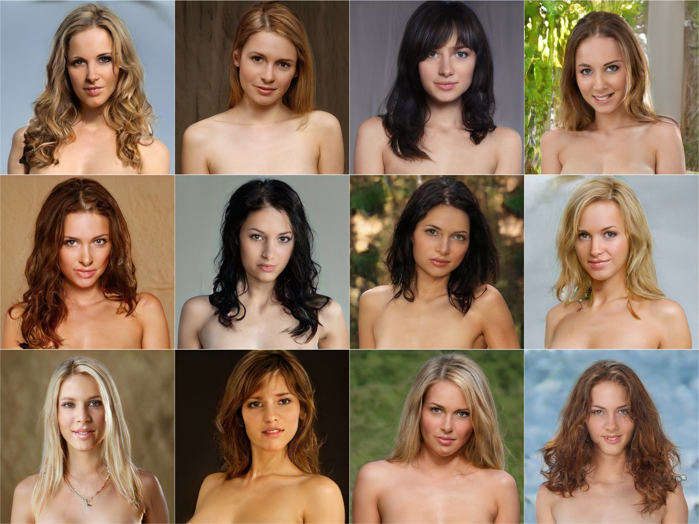
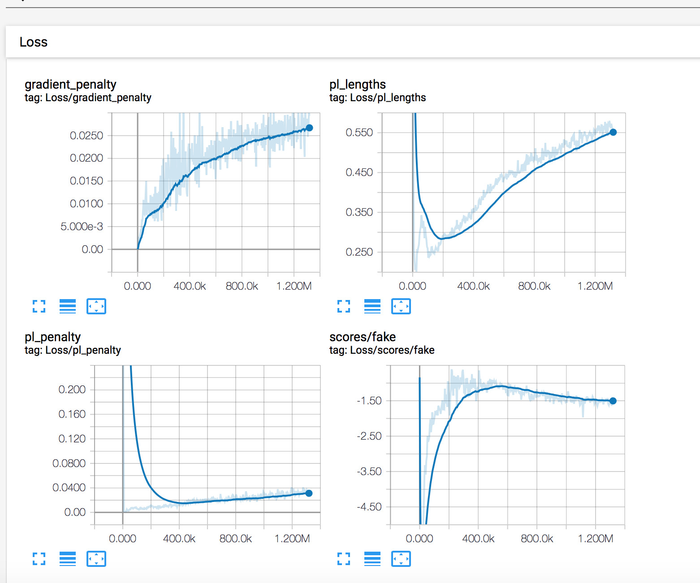
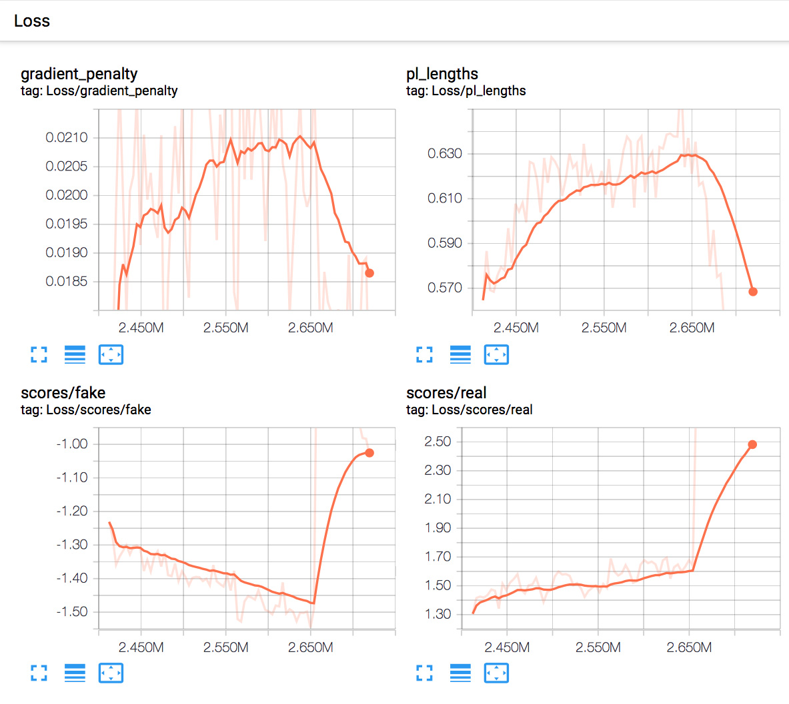
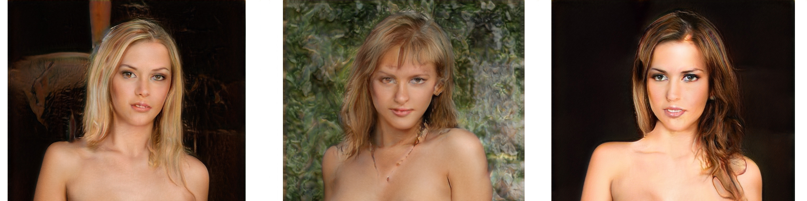
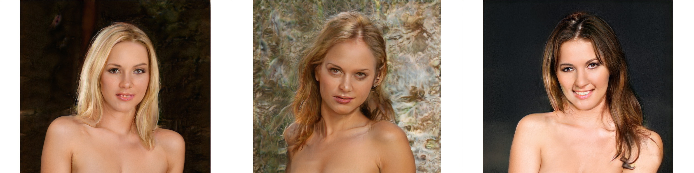
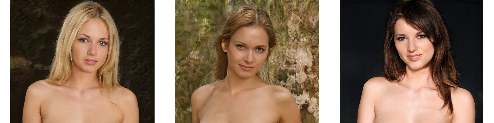
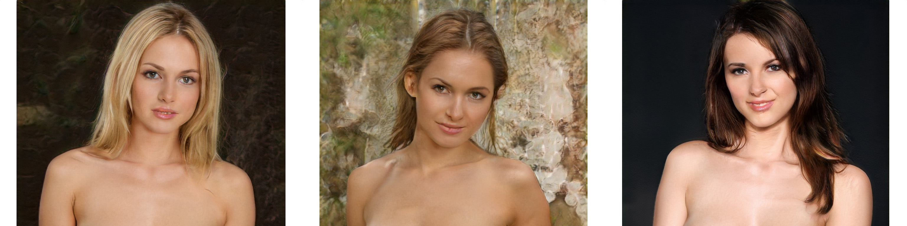
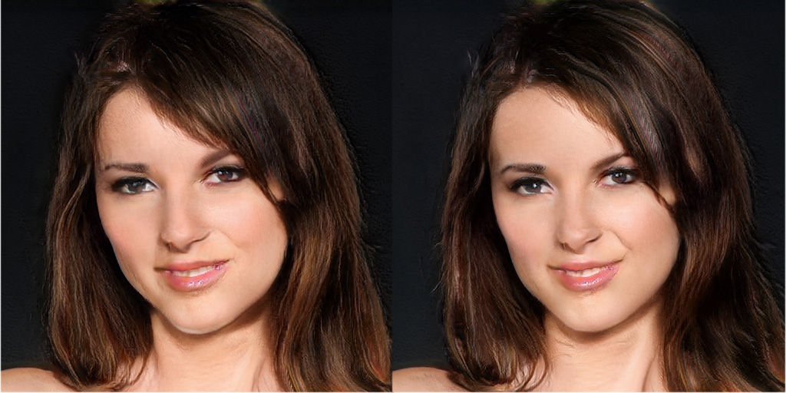
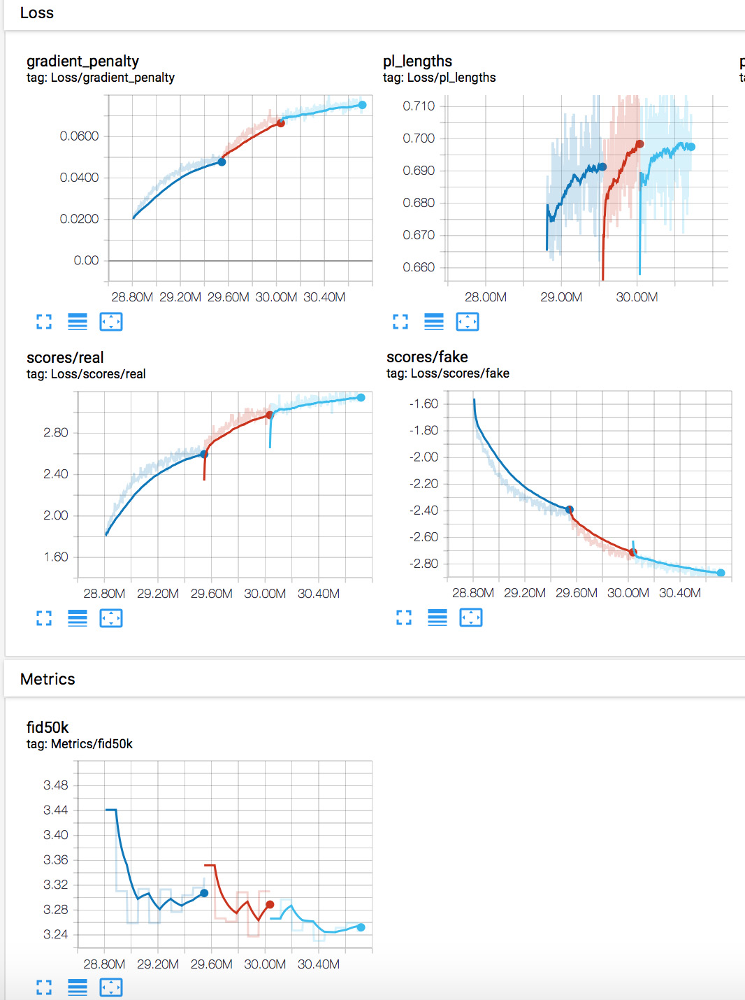
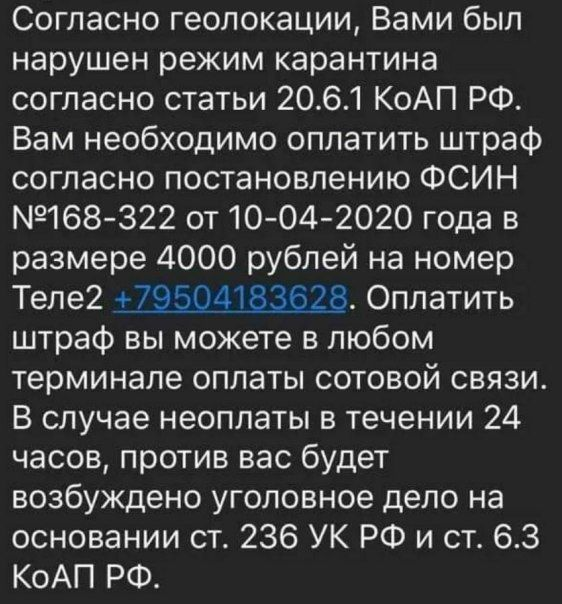

## Practical aspects of StyleGAN2 training

<p align="right">
<i>The entire project, including all exploration, consumed 132 MWh of electricity, of which 0.68 MWh went into training the final FFHQ model. In total, we used about 51 single-GPU years of computation.</i></p>
<p align="right">  <i>— Karras et al</i></p>
</p>

<b>
Disclaimer: Neither me nor this repo is associated in any way with NVidia. I did my DYOR to the best of my ability, nevertheless I might be completely wrong about anything expressed below.
</b>

## TL;DR
<b>NOTE:</b> Continuation of this work is documented in the sequel to this writeup, ["Scaling up StyleGAN2"](http://github.com/l4rz/scaling-up-stylegan2).

I have trained a StyleGAN2 from scratch with a dataset of female portraits at 1024px resolution. The samples quality was further improved by tuning the parameters and augmenting the dataset with zoomed-in images, allowing the network to learn more details and to achieved FID metrics that are comparable to the results of the original work.


*Curated samples, Ψ=0.70*

## Table of Contents
1. [Background](#background)<br>
2. [Dataset preparation](#dataset)<br>
3. [Training environment](#training)<br>
  3.1. [Hardware](#hardware)<br>
  3.2. [Environment](#environment)<br>
4. [Running SG2](#running)<br>
  4.1. [Notes on stability](#stability)<br>
5. [Experiments](#experiments)<br>
  5.1. [Training from scratch, config-f](#foxtrot)<br>
  5.2. [Improving config-f quality](#foxtrot-improv)<br>
6. [Comments and further improvements](#further)<br>

<!--
brs should be added for github
-->

## Background<a name="background"></a>
[StyleGAN2 by Karas et al](https://arxiv.org/abs/1912.04958) ("SG2") is a big improvement compared to the [original StyleGAN](https://arxiv.org/abs/1812.04948) ("SG1"). Inspired by [Gwern's writeup](https://gwern.net/Faces) (I suggest to read it before doing experiments) - and having failed to replicate training of SG1 on anime portraits dataset - I've tried it with SG2. It worked almost out of the box just by decreasing the learning rates slightly. The [FFHQ pre-trained network](https://github.com/NVlabs/stylegan2) was impressive as well.

I was curious how it would work on the human anatomy, so I decided to try to train SG2 with a dataset of head and shoulders portraits. To alleviate capacity issues mentioned in the SG2 paper I preferred to use portraits without clothes (a significant contributing factor to dataset variance); furthermore, the dataset was limited to just one gender in order to further reduce the dataset's complexity.

## Dataset preparation<a name="dataset"></a>

As with other neural networks, prepairing the proper dataset is the most diffucult part of experiments. Since the FFHQ contained 70k images, my aim was to assemble a dataset of comparable size.

Developing a suitable workflow for the automated image processing was crucial.
[Tensorflow Object Detection API](https://github.com/tensorflow/models/tree/master/research/object_detection) ("TF OD") was chosen to detect objects in images and obtain bounding boxes for cropping. TF OD worked well for my purposes, such as face, specific pose and body part detection.

The first step was to train TD OF model on my own dataset to identify a suitably cropped portrait in an image. [Here's a good writeup on how to get started](https://towardsdatascience.com/how-to-train-your-own-object-detector-with-tensorflows-object-detector-api-bec72ecfe1d9). It is possible to train TF OD starting with some 100 or 200 images with respective bounding boxes (xmin, ymin, xmax, ymax) for objects and object classes. [LabelImg](https://github.com/tzutalin/labelImg) could be used create an XML with bounding boxed and annotations, followed by [The `test_xml_to_csv.py` python script](https://github.com/datitran/raccoon_dataset) to convert XML to CSV:

```
filename,width,height,class,xmin,ymin,xmax,ymax
cropped_111026_013.jpg,1920,1080,portrait,185,157,1778,1822
cropped_111026_032.jpg,1920,1080,portrait,159,47,1726,2974
cropped_111035_029.jpg,1920,1080,portrait,782,328,2403,3178
cropped_111035_030.jpg,1920,1080,portrait,696,325,2551,3365
```

The CSV together with images are then converted to `.tfrecords` format used by TF OD training script. [ImageMagick](https://imagemagick.org) ("IM") is useful for images manipulation. I used TF OD `ssd_mobilenet_v1_pets.config` config template without significant modification. `model_main.py` run takes 2-3 hours on a 1080ti; `export_inference_graph.py` script produces a frozen inference graph (`.pb` file) that could be used as follows:

```
import numpy as np
import tensorflow as tf
import cv2 as cv

with tf.gfile.FastGFile('frozen_inference_graph_faces.pb', 'rb') as f:
    graph_def = tf.GraphDef()
    graph_def.ParseFromString(f.read())
with tf.Session() as sess:
    sess.graph.as_default()
    tf.import_graph_def(graph_def, name='')
    img = cv.imread(filename)
    rows = img.shape[0]
    cols = img.shape[1]
    inp = cv.resize(img, (300, 300))
    inp = inp[:, :, [2, 1, 0]]
    out = sess.run([sess.graph.get_tensor_by_name('num_detections:0'),
        sess.graph.get_tensor_by_name('detection_scores:0'),
        sess.graph.get_tensor_by_name('detection_boxes:0'),
        sess.graph.get_tensor_by_name('detection_classes:0')],
        feed_dict={'image_tensor:0': inp.reshape(1, inp.shape[0], inp.shape[1], 3)})
    num_detections = int(out[0][0])
    highscore = 0
    for i in range(num_detections):
            score = float(out[1][0][i])
            if score > highscore:
                highscore = score
                bbox = [float(v) for v in out[2][0][i]]

    for highscore > 0.98: # adjust
        x = int(bbox[1] * cols )
        y = int(bbox[0] * rows   )
        right = int(bbox[3] * cols )
        bottom = int(bbox[2] * rows )
        crop_img = img[crop_y:crop_bottom, crop_x:crop_right]
        # ...
```

I didn't liked LabelImg so I used this code with [a pre-trained face detection model by aodiwei](https://github.com/aodiwei/Tensorflow-object-detection-API-for-face-detcetion) in a script that displays (using [opencv](https://github.com/opencv/opencv)) a box sized 3 by 4 time of detected face, takes keyboard input to adjust the bounding box coordinates (or reject the image) and saves the CSV file.

Transfer learning works well for TF OD training. Having trained the portrait crop detection model, I've used it with the script mentioned above to expand the TF OD training dataset by semi-automatically cropping and labelling ~1000 images.

Running through one million of source images takes 10-20 hours on a 1080ti (depending on the resolition), limited mostly by HDD speed.

I ended up developing a few scripts for automated source image processing that implement heuristic filtering and cropping approaches. Some of those scripts employed multiple TF graphs to detect poses and body parts and filter/crop according to detection scores and spatial localizations of detected objects, thus allowing to build a more or less uniform datasets.

Alternatively, a Fréchet Inception Distance ("FID") may be used for filtering images. FID is a metric of similarity between images. I used [PyTorch FID implementation](https://github.com/mseitzer/pytorch-fid) to sort through portraits and remove the ones with undesirable poses, e.g. with hands behind head or crossed arms by creating a small dataset with reference images and specifying a cutoff FID of 120-150. FID approach only works for the cleaning of already cropped images set.

Images were scaled down and padded to 1024px squared using IM:

```
mkdir 1024
mkdir 1024px
cd images
for i in *.jpg; do convert "$i"  -quality 95% -resize 1024x1024 "../1024/$i"; done
cd ../1024
for i in *.jpg; do convert "$i"  -quality 95% -gravity center -background white -extent 1024x1024 "../1024px/$i"; done
```

To control the quality of dataset, I've discared all images with resolution less than 1024px. The final dataset, *TF36K*, included 36K portraits. The dataset was converted to `.tfrecords` format using the provided `dataset_tool.py`. The size of 36K dataset was approximately 150Gb.

<b>NOTE:</b> I wasn't centering the vertical axis of portraits around face. Face sizes were not uniform, either (20-30% of image size). The aim of these experiments was to test the limits of SG2 in complex object representation, not to achieve photorealistic quiality on a perfecly aligned dataset.


## Training environment<a name="training"></a>

### Hardware<a name="hardware"></a>

SG2 training runs consume a lot of GPU cycles, especially on 1024px and larger networks (`config-f`, fmap_base = 16384 and more).

Running a minibatch of 4 per GPU takes requires ~13Gb on 1024px (`config-f`). Increasing fmap_base to 24576 takes 18Gb on the same minibatch size. Some VRAM headroom is required to generate samples during the training and run the metrics.

I can confirm that SG2 training works on AMD GPUs (tested with AMD Radeon Pro Duo 2x4Gb, ROCm 3.1.0, TF 1.15.0 docker image pulled from rocm/tensorflow) after patching `.py` files in `dnnlib/tflib/ops` by replacing all instances of `impl='cuda'` to `impl='ref'`, though I was unable to get it running on more than one GPU. It would be helpful if anyone had tried it on the Radeon VII 16Gb.
<!--
(Please refer to [Gwern's notes](https://gwern.net/Faces#running-s2) for running on 1080ti)
-->
All training runs described below were made on 4xV100 32Gb.

### Environment<a name="environment"></a>

Since I've been tired of fixing broken dependencies I choose to create a separate docker container for each project.

I used `Dockerfile` supplied with SG2, `tensorflow/tensorflow:1.15.0-gpu-py3` image, Docker version 19.03.5, CUDA 10.0. `Dockerfile` was customized with `imagick` and other useful utilities. After setting everything up, you can check whether GPU is accessible:

```
docker run -v /home/l4rz:/home/l4rz -v /mnt:/mnt --gpus all -it --rm <image> bash

stylegan2 l4rz$ ./test_nvcc
CPU says hello.
GPU says hello.
```

After that, check that inference (`generate_images.py`) is working and you're ready to go.

To monitor training progress [TensorBoard](https://www.tensorflow.org/tensorboard) should be installed and pointed to `results` dir.

<!--
Note that in order to run SG2 with minibatch of 1 [you need to patch](https://gwern.net/Faces#running-s2) `training/loss.py`. -->

## Running SG2<a name="running"></a>

Running SG2 is pretty straghtforward. You need to edit config in `run_training.py`

```
if config_id == 'config-f':
    G.fmap_base = D.fmap_base = 16 << 10 # default value
    sched.G_lrate_base = sched.D_lrate_base = 0.001
```

The default learning rate of 0.002 is likely too high for those datasets that are less curated and aligned than FFHQ. <!-- Other than that, in comparison with SG1, SG2 with new architectures (`config-e`, `config-f`) gives you a smooth pleasant ride. -->


*Takeoff*

As training progresses, you should observe progress in decreasing losses of  of D (Loss/scores/real), G (Loss/scores/fake). `pl_lengths` gradually increasing and `scores` converging closer to zero.

To the best of my experience, subjective visual quality is the best metric. FID50 could be used to compare different experiments with more or less similar dataset. I've turned off metrics completely by commenting out `metrics.run()` line in `training_loop.py` and used it only during final runs.

The training grid (`fakes*.png`) could be useful to judge the image quiality during early stages of training. Later I used periodic sampling with the same set of seeds and a couple of different `truncation-psi` parameters. Note that the training grid is produced without Ψ truncation.

Normally it's not needed to run with different learning rates for G and D. Moreover, likely because of path length regularization in the new network architectures, using different learning rates doesn't lead to such a dramatic changes in the training as it was with SG1. This could be the reason why the SG2 code actually ignores different settings for G and D learning rates ([as it was discovered by theshawwn](https://twitter.com/theshawwn/status/1230022825538248704)). You need to modify the code to use different values for `G_lrate_base` and `D_lrate_base`, as well as observe `TrainG/learning_rate` and  `TrainD/learning_rate` in tensorboard to make sure that the desirable values are actually applied.

You should be observing first meaningful results around 1000 kimg. As soon as `pl_lengths` plateaus and/or there's no improvement in output quality, it's probably the time to decrease the learning rate.


### Notes on stability<a name="stability"></a>

Even with disabled metrics.run (that could contribute to memory leaks), SG2 sometimes crashes. In my experiments I've observed `CUDA_ERROR_ILLEGAL_ADDRESS` crashes.

At some point the training will likely become unstable run into mode collapse, observable by sharp jumps in G/D losses:



*Collapse*

G and D instabilities in GANs are analysed in details in [Brock et al BIGGAN paper](https://arxiv.org/abs/1809.11096) paper. Though BIGGAN architecture is quite different in coparison to SG2, these discussions are applicable to some degree. It's a GAN after all.

During the course of numerous SG2 runs, I've found a couple of factors that cause and/or contribute to collapse:

1) Learning rates are too high, the solution is to decrease learning rates.

2) Dataset is too small, D overfitting. The obvious remedy is to increase dataset size. I believe that the minimum dataset size for SG2 training from scratch is around 20-30k samples.

3) Dataset is too diverse. The solutions are either to decrease the diversity of dataset (in my case, I tried to stick to just one pose) or it that is unpractical, to use more severe regularization, at a cost of quality.

SG2 uses R1 regularization, controllable via γ (`d_loss.gamma`) regularization weight. This parameter penalizes non-smoothiness of gradient landscape formed by small changes in any dimension of W latent space. Practically, it stabilizes the network, allowing higher learning rates to be used with a less uniform dataset while avoiding mode collapse. I think that was the reason why Karras et al resorted to increasing γ ten times with `HORSE` dataset.

While using heavy regularization, it might be useful to switch to larger γ values early in training and then to taper it off once the network becomes sufficiently stable.

(More on regularization effects in [Roth et al paper](https://arxiv.org/abs/1705.09367) and [Mescheder et al](https://arxiv.org/abs/1801.04406).)

You should keep a couple of recent checkpoints to be able to go back. Sometimes it is not possible to progress further from the checkpoint that is saved just before collapse.

## Experiments<a href="experiments"></a>

### Training from scratch, config-f<a href="foxtrot"></a>

I've trained SG2 `config-f` on 36K portraits dataset. Initial LR was 10<sup>-3</sup>, gradually decreasing to 10<sup>-4</sup> around 20000 kimg and further to 10<sup>-5</sup>. Minibatch size was 32, mirror augmentation was enabled, other training parameters were left stock.


*Seeds 0,7083,25026 Ψ=0.60 @ 3191 kimg*


*Seeds 0,7083,25026 Ψ=0.60 @ 10191 kimg*


*Seeds 0,7083,25026 Ψ=0.60 @ 25451 kimg, FID=3.57*

<b>NOTE:</b> samples are cropped.

### Improving config-f quality<a href="foxtrot-improv"></a>

It was suggested to augment 36K dataset with some percentage of zoomed-in samples (face covering vertically about 50% of image size). Adding female faces from FFHQ didn't work for me, so I added 14K of zoomed-in samples from the original dataset, increasing its size to 50K, and continued training from the latest 25451 kimg checkpoint with learning rates of 10<sup>-5</sup>. Since the network was pretty stable at this moment, I opted for decreasing `d_loss.gamma` at the same time. This led to noticeable improvement of face quaility and FIDs.


*Seeds 0,7083,25026 Ψ=0.60 @ 30445 kimg with 50K augmented dataset, FID=3.24*


*Seed 25026 Ψ=0.60 face @ 25451 kimg (36K original dataset) vs the 30445 kimg (50K augmented dataset), zoomed in for  better representation quality*


*γ tapering effects, from 10 to 5 and to 3*

<!-- <a sample @ 2000k img>
<a sample @ 10000k img>
<a sample @ 25000k img>
-->

<!--
  |  |  
:-------------------------:|:-------------------------:|:-------------------------:
2000 kimg             |  10000 kimg |  25000 kimg
-->


## Comments and further improvements<a href="further"></a>

I haven't quite been able to achieve the quality of SG2 trained with the FFHQ dataset. After over than 30000 kimg, the samples are not yet as detailed as it is desirable. For example, teeth look blurry and pupils are not perfectly round. Considering the size of my dataset as opposed to the FFHQ one, the cause is unlikely to be the lack of training data. Continuing the training does not appear to help as is evident from the platau in FIDs.

Overall, my experience with SG2 is well in line with what others are observing. Limiting the dataset to a single domain leads to major quality improvements. SG2 is able to model textures and transitions quite well.  At the same time it is struggling as the complexity of the object increases with, for instance, greater diversity in poses. It should be noted that SG2 is much more efficient for single domain tasks compared to other architectures, resulting in acceptable results much faster.

From my preliminary observations, it could be that the increase in network capacity will lead to further improvements, both in detail and in diversity.

Doubling the `fmap_base` parameter leads to doubling the number of feature maps in higher resolutions. To double the total feature map count, one needs to increase `fmap_max` parameter as well. The resulting network is 3.77x larger than `config-f` and training is three times slower.

|      | fmap_base = 16384, fmap_max = 512 (config-f) | fmap_base = 32768, fmap_max = 512| fmap_base = 32768, fmap_max = 1024
| ------------- |:-------------:| -----:|-----:|
| 4px fmaps     | 512| 512 | 1024
| 8px fmaps     | 512| 512 | 1024
| 16px fmaps     | 512 | 512 | 1024
| 32px fmaps     | 512 | 512 | 1024
| 64px fmaps     | 512 | 512 | 1024
| 128px fmaps    | 256 | 512 | 512
| 256px fmaps | 128    | 256  | 256
| 512px fmaps | 64    | 128 | 128
| 1024px fmaps   | 32    | 64 | 64
| Total params | 59K |  70K | 223K
| Seconds per kimg (4xV100) | 65      |   146 | 192

Continued here: ["Scaling up StyleGAN2"](http://github.com/l4rz/scaling-up-stylegan2)

## Written by

[l4rz](https://twitter.com/l4rz)
